# Ejercicio - Xepelin


- [Ejercicio](#ejercicio)
    - [Especificaciones](#especificaciones)
    - [Tecnologias](#tecnologias)
    - [Arquitectura](#arquitectura)
- [Setup](#setup)
    - [Instrucciones](#instrucciones)
- [Cobertura](#cobertura)

## Ejercicio

### Especificaciones

Se requiere implementar una automatizacion que permita la creacion de cuentas bancarias.

### Tecnologias

- [Java11](https://jdk.java.net/17/)
- [Kotlin](https://kotlinlang.org/)
- [Vert.x](https://vertx.io/)
- [RX Java3](http://reactivex.io/)
- [JUnit5](https://junit.org/junit5/docs/current/user-guide/#overview-getting-started)

La solucion esta apalancada en el marco de estrategias GRASP, basado en los conceptos que nos
expone Chris Richartdson con su libro Microservices Pattern tomando de esto los conceptos de
Event Sourcing y Event Driven, como tambien ciertas articulaciones con SAGA para que los eventos de
cada cada transaccion local, publiquen eventos de dominio que desencaden transacciones 
locales en otros servicios (Choreography Strategy).

Tambien puedo resaltar que se adecua los estandares o patrones DDD para la separacion de responsabilidades y sus patrones
de diseño, como muestro en las imagenes a continuacion:

Tenemos un mono repo de MS con tenenidos con la herramienta Gradle

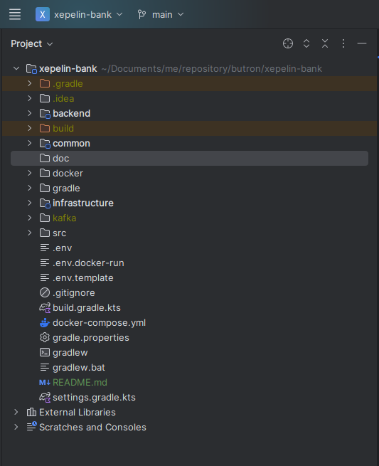

haremos un pequeño tour por de como esta solucion responde a las necesidades bancarias que nos resalta la prueba, para ello 
creamos 3 Micro Servicios usando la estrategia database por servicio y API Composition, vemos que los los servicios estan 
aislados por infrastructure, common, adapters, app y domain

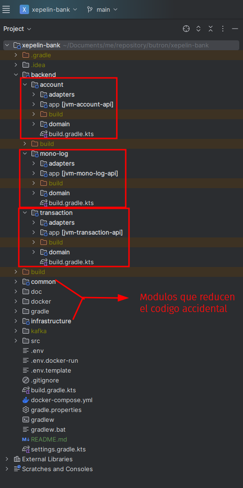

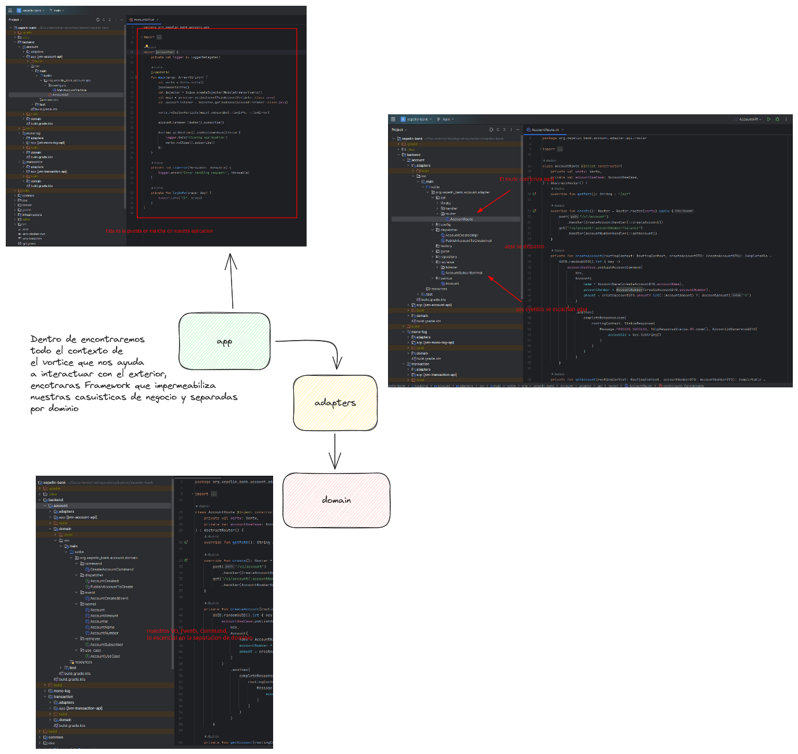

Asi como vemos en nuestras carpetas de trabajo reducimos estos componentes con esto

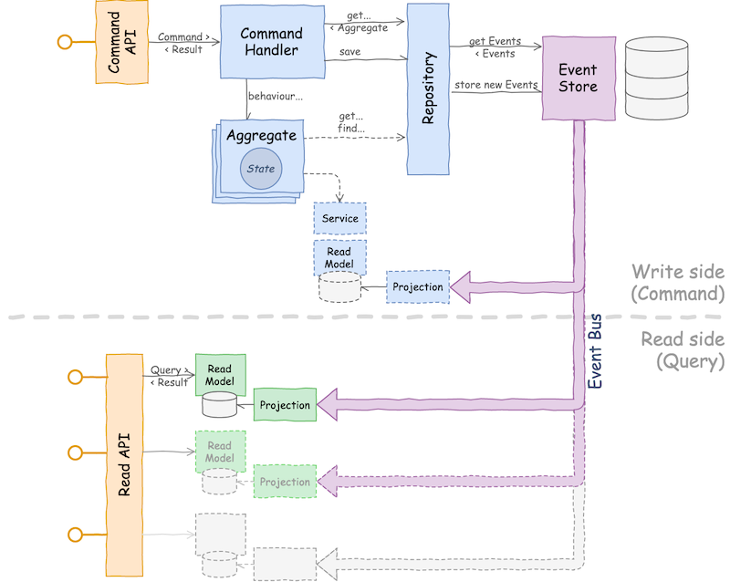
## Setup

### Instrucciones

Para dar marcha a este proyecto debemos tener Java17 y Gradle 8.4.0 (por suerte tenemos Docker :D) para poder asi configurar las dependencias de este.

1. Clonamos el proyecto (recuerde que debemos tener Git para ello)
2. Dentro del proyecto ud debera copiar el archivo `.env.docker-run` (sin eliminarlo) y lo colocara como .env, si uds tambien quiere explorar el proyecto
   existen dos momentos con los archivo `.env.docker-run` que es solo si ejecuta el docker compose para que despliegue las imagenes
   de los JARs con todo el aprovicionamiento para ver la solucion, para ello debe copiar el archivo `.env.template-run` (sin eliminarlo) y colocarlo como .env
   adicional a ellos ejecutamos los siguientes comandos

   ```docker compose  -f "docker-compose.yml" up -d --build postgres-local```
   ```docker compose  -f "docker-compose.yml" up -d --build zookeeper-local```
   ```docker compose  -f "docker-compose.yml" up -d --build kafka-local```

3. Ejecutamos ```docker compose  -f "docker-compose.yml" up -d```
4. Abrimos nuestra consola y ejecutamos o copiamos estos curls para que se nos faciliten en el postman

Revisamos nuestros MS que esten arriba despues de que el Docker finalice
```
curl --location 'http://localhost:9040/account/health-check'
```

```
curl --location 'http://localhost:9030/transaction/health-check'
```

```
curl --location 'http://localhost:9020/mono-log/health-check'
```

Por ultimo hacemos el proceso de creacion de cuenta 

```
curl --location 'http://localhost:9040/account/api/v1/create' \
--header 'Content-Type: application/json' \
--data '{
"account-name": "Tu Nombre",
"account-number": "123456",
"amount": "15080"
}
'
```
Si queremos revisar nuestro balance mira el enlace de abajo :v

```
curl --location 'http://localhost:9040/account/api/v1/02da8662-e600-4364-b4c0-d80203fb723a/balance'

o

curl --location 'http://localhost:9040/account/api/v1/:accountId/balance'
```

Y por ultimo si queremos afectar nuestro balance veamos el siguiente link

```
curl --location 'http://localhost:9030/transaction/api/v1/create' \
--header 'Content-Type: application/json' \
--data '{
    "transaction-type": "DEPOSIT",
    "account-id": "02da8662-e600-4364-b4c0-d80203fb723a",
    "amount": "200"
}'

o

curl --location 'http://localhost:9030/transaction/api/v1/create' \
--header 'Content-Type: application/json' \
--data '{
    "transaction-type": "WITHDRAWAL",
    "account-id": "02da8662-e600-4364-b4c0-d80203fb723a",
    "amount": "200"
}'

```

Aqui unas pruebas del flujo de como el MS interactua con Account -> Mono-Log -> Account, para dejar track de todo los procesos que hacen lo comando y eventos

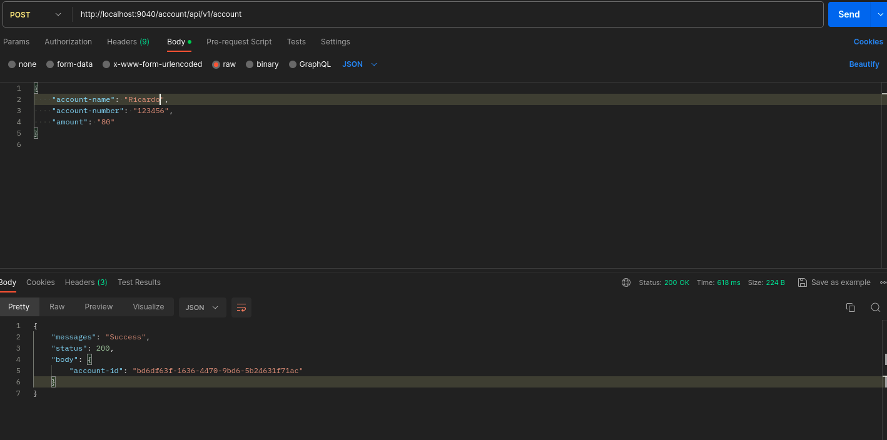

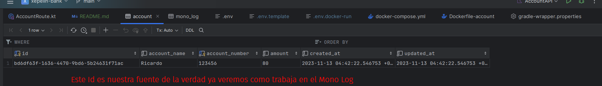

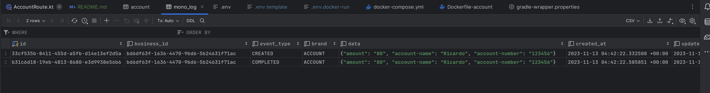

Aqui muestro otros escenarios de pruebas cuando se crea un cuenta con transaccion

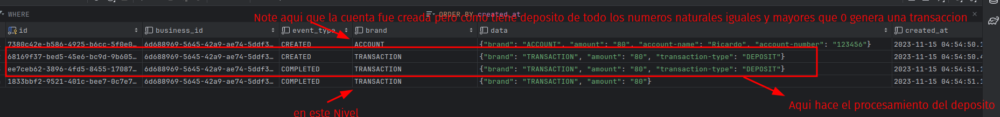

En esta parte muestro el escenario de transacciones

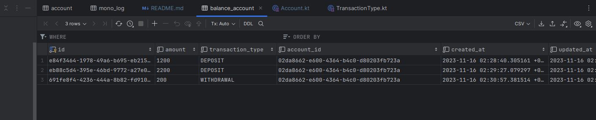

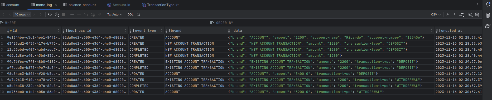

Y por ultimo la implementacion del Middleware que presta como principio un handler para imprimir el valor superado por 10,000 US$

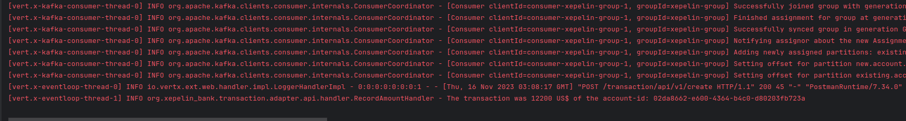

Espero tener la oportunidad para explicarlo con mas detalle, excelente dia
